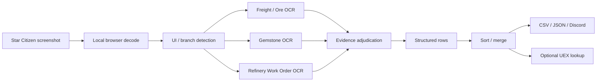

# sPg Refinery Kép Elemző

**Star Citizen Freight / Gemstone / Refinery OCR + UEX segédeszköz**

[English](README_EN.md) · [Status](STATUS.md) · [Release Standard](docs/RELEASE_STANDARD.md)

> Nem hivatalos, nem kereskedelmi Star Citizen rajongói projekt. Nem kapcsolódik a Cloud Imperium Games / Roberts Space Industries szervezeteihez, és azok nem támogatják vagy hagyták jóvá.

## Mi ez?

Egy egyfájlos, böngészőben futó Star Citizen segédeszköz. A felhasználó screenshotjaiból OCR-rel material-, Quality- és mennyiségi adatokat készít.

**Main artifact:** `index.html`  
**Current baseline:** V1.40R23R6 Freight Material Evidence Adjudicator  
**SHA-256:** `a408b5377f34bad89ac5ec189394ae10c7c6bbe1b8d700b7b3b286e5569f0128`

A CSS és JavaScript az `index.html` fájlban van. Nincs build-rendszer és nincs saját backend.

## Fő funkciók

- Freight Manager / Ore OCR;
- Gemstone OCR, `Xnn` készletdarabszámmal;
- Refinery Work Order felismerési infrastruktúra;
- Material + Q merge;
- UEX API 2.0 eladóhely/ár/demand lekérés;
- CSV, JSON és Discord Markdown export;
- HU / EN felület;
- diagnosztikai OCR/debug log.

## Gyors használat

1. Nyisd meg az `index.html` fájlt vagy a GitHub Pages oldalt.
2. Adj hozzá Star Citizen screenshotokat.
3. Indítsd el a felismerést.
4. Ellenőrizd a material / Q / mennyiség sorokat.
5. Opcionálisan vond össze az azonos Material + Q sorokat.
6. Opcionálisan kérj UEX adatot.
7. Exportálj CSV, JSON vagy DC/Discord formátumba.

Részletes használat: [README_HU.md](README_HU.md)

## Feldolgozási folyamat

## R23R6 Freight material döntés

A material-felismerés nem first-match-wins. A bizonyítékok erősségi elve:

**exact canonical > exact manual alias > exact alias/compact > clipped/edge > partial > ngram > fuzzy**

Ez javította a valós Iron → Construction Materials tévesztést filename/material hardcode nélkül.

## Validáció

### Friss R23R6 Freight browser run

- 109 kép
- 109 eredménysor
- review: 0
- 82.239 SCU
- 9 kritikus target ellenőrizve

### Korábbi vegyes regresszió

- 90 kép
- 56 Freight/Ore
- 34 Gemstone
- 90 sor
- review: 0
- 24/24 kritikus target PASS
- Ore: 48.745 SCU
- Gemstone: 1504 db

A két suite nem helyettesíti egymást. A friss 109 képes suite Freight-only.

## Adatforrások és licencek

- Tesseract.js 5.1.1 — browser OCR
- tesseract.js-core — OCR core/WASM
- angol Tesseract language data
- jsDelivr — runtime delivery
- Google Fonts — Orbitron + Roboto
- UEX API 2.0 — community material/system/market data
- Star Citizen / CIG / RSI — fan-project kontextus

A saját sPg kód és dokumentáció licence: **MIT** ([LICENSE](LICENSE)). Ez nem licenceli újra a harmadik felek komponenseit és szolgáltatásait.

Részletek: [SOURCES_HU.md](SOURCES_HU.md), [THIRD_PARTY_NOTICES.md](THIRD_PARTY_NOTICES.md), [LICENSE.md](LICENSE.md)

## Privacy és security

A projektnek nincs saját screenshot-upload backendje. A képfeldolgozás a böngészőben történik. Külső hálózati kapcsolatok a runtime függőségek és az opcionális UEX lekérés miatt vannak.

- [PRIVACY.md](PRIVACY.md)
- [SECURITY.md](SECURITY.md)

## Ismert korlátok

- Star Citizen UI/patch változás megtörheti a geometry/crop feltételezéseket.
- Felbontás, scaling, HDR és kompresszió befolyásolhatja az OCR-t.
- UEX közösségi adat, nem garantált live igazság.
- A 109 képes friss suite Freight-only.
- Fresh full Gemstone és Refinery Work Order regresszió nincs 2026-09-23-ra dokumentálva.

## Fejlesztés / Codex

Normál fejlesztésnél: [AGENTS.md](AGENTS.md), [STATUS.md](STATUS.md), [DEVELOPMENT/CODEX_WORKFLOW_HU.md](DEVELOPMENT/CODEX_WORKFLOW_HU.md).

Teljes GitHub release/package munkánál: [docs/RELEASE_STANDARD.md](docs/RELEASE_STANDARD.md).

## Release státusz

A csomag a Standard V4.2 szerint készült. A korábbi licenc-blokk megszűnt: a tulajdonos MIT licencet választott.

- **PACKAGE STATUS:** **READY WITH LIMITATIONS** — a friss 109 képes suite csak Freight, és a live UEX integráció nem futott újra ebben a csomagolási körben.
- **PUBLISHED RELEASE STATUS:** a feltöltés utáni friss klónos ellenőrzés igazolja (lásd [STATUS.md](STATUS.md)).

- [Release Contract](docs/RELEASE_CONTRACT.md)
- [Release Gate Summary](docs/RELEASE_GATE_SUMMARY.md)
- [Release Process](docs/RELEASE.md)
- [Architecture Overview](docs/ARCHITECTURE_OVERVIEW.md)
- [CHANGELOG](CHANGELOG.md)
