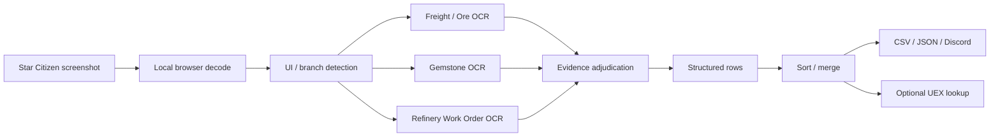

# sPg Refinery Image Analyzer

**Star Citizen Freight / Gemstone / Refinery OCR + UEX helper**

[Magyar](README.md) · [Részletes magyar dokumentáció](README_HU.md) · [Status](STATUS.md) · [Release Standard](docs/RELEASE_STANDARD.md)

> Unofficial, non-commercial Star Citizen fan project. Not affiliated with, endorsed by, or approved by Cloud Imperium Games / Roberts Space Industries.

## What is it?

A single-file browser utility that turns user-provided Star Citizen screenshots into structured material, Quality and quantity data using OCR.

**Main artifact:** `index.html`  
**Current baseline:** V1.40R23R6 Freight Material Evidence Adjudicator  
**SHA-256:** `a408b5377f34bad89ac5ec189394ae10c7c6bbe1b8d700b7b3b286e5569f0128`

CSS and JavaScript are embedded in `index.html`. There is no build system and no project-owned backend.

## Main features

- Freight Manager / Ore OCR;
- Gemstone OCR with `Xnn` inventory count;
- Refinery Work Order recognition infrastructure;
- Material + Q merge;
- optional UEX API 2.0 sell/price/demand lookup;
- CSV, JSON and Discord Markdown export;
- HU / EN interface;
- detailed OCR/debug logging.

## Quick use

1. Open `index.html` or the GitHub Pages deployment.
2. Add Star Citizen screenshots.
3. Run recognition.
4. Review material / Q / quantity rows.
5. Optionally merge identical Material + Q rows.
6. Optionally query UEX.
7. Export CSV, JSON or Discord Markdown.

Detailed usage: see [Detailed usage](#detailed-usage) below.

## Processing workflow

## Why was it made?

Writing down Star Citizen mining/refinery inventory by hand is slow for many items, and it is especially easy to get the Quality or a decimal SCU value wrong. The project therefore does not aim for "a match at any cost", but for evidence-based recognition.

Core principles:

- missing data is never invented;
- OCR passes are not automatically independent evidence;
- in uncertain cases a review row is better than a confidently wrong row;
- material, Q and quantity must belong to the same UI element;
- hardcoding a file name, material or number is never an OCR fix;
- user screenshots are never sent to a project-owned server.

## Detailed usage

### 1. Images

On the **Images** panel:

- load images with the file picker or drag and drop;
- **Paste from clipboard**: in supported browsers an image can be pasted directly;
- **Recognize images**: starts OCR;
- **Clear all**: empties the images and rows of the current session;
- **1-click log**: copies the debug log;
- **Refresh UEX material list**: reloads the material catalogue;
- **Load sample data**: UI/export trial, not an OCR test.

### 2. OCR settings

**Crop mode**
- Automatic refinery-panel crop — default.
- Full image — for debugging/fallback.

**Preprocess**
- High-contrast, inverted — default.
- Grayscale.
- Original image.

**Fallback full**
- when enabled, the pipeline may also use a full-image fallback when needed.

### 3. Recognized items

Depending on the screenshot type, each row stores material, Q and quantity.

**Freight/Ore**
- quantity: actual SCU;
- Capacity can act as a validation guard, not as an automatic inventory quantity.

**Gemstone**
- quantity: the `Xnn` badge of the selected card;
- the tooltip's `0.001 SCU` value is the physical size of one piece, not the total inventory.

Buttons:
- **New row** — manual row;
- **Merge identical material and Q** — sums identical Material + Q;
- **DC** — copies Discord Markdown.

Global order:

**Ore A–Z → Gemstone A–Z → within the same material, Q ascending.**

### 4. UEX sell-location lookup

The program uses the public GET resources of UEX API 2.0.

Main functions:
- refresh system list;
- material catalogue and aliases;
- sell location / price / demand lookup;
- Quality tolerance;
- optional wider Q fallback.

The program does not invent an undocumented Q price formula. UEX is a community database, so its data can differ from the current live server.

### 5. Export

- **CSV** — tabular export;
- **JSON** — machine-readable export;
- **DC** — Discord Markdown.

For SCU/cSCU output the program normalizes to at most 3 decimals, so floating-point noise such as `0.402999999...` cannot appear.

## Hungarian / English interface

Switch the interface with the **HU / EN** buttons in the top right. OCR still uses the English Tesseract model, because the Star Citizen UI and material names are English.

## Internet connection

OCR itself runs in the browser, but the current release uses remote runtime services:

- Tesseract.js 5.1.1 — jsDelivr;
- Tesseract English OCR data/runtime assets — resolved by Tesseract.js defaults;
- Google Fonts — Orbitron and Roboto;
- UEX API 2.0.

The application is therefore not fully offline.

## R23R6 Freight material rule

Material selection is not first-match-wins. Evidence strength follows:

**exact canonical > exact manual alias > exact alias/compact > clipped/edge > partial > ngram > fuzzy**

This fixed the real Iron → Construction Materials false classification without filename/material hardcoding.

## Validation

Fresh R23R6 Freight browser run: 109 images, 109 rows, review 0, 82.239 SCU, 9 critical targets verified.

Earlier mixed regression: 90 images, 56 Freight/Ore, 34 Gemstone, review 0, 24/24 critical targets PASS, 48.745 SCU Ore, 1504 Gemstone pieces.

The suites complement each other. The fresh 109-image suite is Freight-only.

## License and legal status

The original sPg application code and project documentation are licensed under **MIT** ([LICENSE](LICENSE), status: [LICENSE.md](LICENSE.md)). This covers only the project's own work and does not relicense third-party components or services.

Third parties:
- Tesseract.js — Apache-2.0;
- tesseract.js-core — Apache-2.0;
- `@tesseract.js-data/eng` — MIT package metadata;
- Orbitron — SIL OFL 1.1;
- Roboto — Apache-2.0;
- UEX — service/API terms;
- Star Citizen/CIG/RSI — own ToS and fan-content rules.

Details: [SOURCES_EN.md](SOURCES_EN.md), [THIRD_PARTY_NOTICES.md](THIRD_PARTY_NOTICES.md).

## Privacy and security

There is no project-owned screenshot-upload backend. Screenshot processing happens in the browser.

External network connections still exist to the runtime services listed above. As normal web behaviour, these services can see data needed for the request, such as IP address and browser information.

Requests to UEX contain material/market API queries, never screenshots.

Details: [DEVELOPMENT/PRIVACY_EN.md](DEVELOPMENT/PRIVACY_EN.md).

- [PRIVACY.md](PRIVACY.md)
- [SECURITY.md](SECURITY.md)

## Known limitations

Star Citizen UI/patch changes, resolution/scaling/HDR/compression and external API changes can affect behavior. UEX is community data, not guaranteed live truth. A fresh full Gemstone and Refinery Work Order regression is not documented for 2026-09-23.

## Development / Codex

For normal development read [AGENTS.md](AGENTS.md), [STATUS.md](STATUS.md) and [DEVELOPMENT/CODEX_WORKFLOW_EN.md](DEVELOPMENT/CODEX_WORKFLOW_EN.md).

For full GitHub release/package work use [docs/RELEASE_STANDARD.md](docs/RELEASE_STANDARD.md).

## Bug reporting

When reporting a bug, include:

- the full screenshot file name;
- Star Citizen patch/build information;
- browser;
- the program's APP_VERSION;
- expected result;
- actual result;
- the output of the **1-click log**.

Only attach a screenshot to a public GitHub issue if you really want its content to be public.

Detailed guide: [DEVELOPMENT/TROUBLESHOOTING_EN.md](DEVELOPMENT/TROUBLESHOOTING_EN.md).

## Release status

The package follows Standard V4.2. The previous licence block is resolved: the owner selected MIT.

- **PACKAGE STATUS:** **READY WITH LIMITATIONS** — the fresh 109-image suite is Freight-only and live UEX integration was not rerun in this packaging pass.
- **PUBLISHED RELEASE STATUS:** validated by the post-publish fresh-clone check (see [STATUS.md](STATUS.md)).

- [Release Contract](docs/RELEASE_CONTRACT.md)
- [Release Gate Summary](docs/RELEASE_GATE_SUMMARY.md)
- [Release Process](docs/RELEASE.md)
- [Architecture Overview](docs/ARCHITECTURE_OVERVIEW.md)
- [CHANGELOG](CHANGELOG.md)
