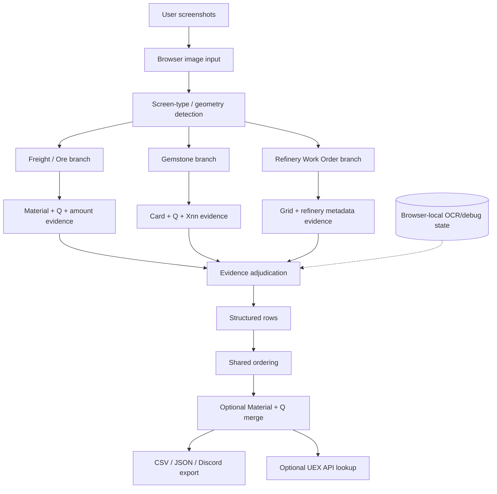

# Architecture overview

Critical invariants: single-file `index.html`; no fabricated OCR values; no screenshot-filename hardcodes; correlated OCR passes are not automatically independent proof; Freight material evidence is strength-ranked; Gemstone quantity is `Xnn`; ordering is Ore A–Z → Gemstone A–Z → Q ascending; runtime PASS requires an actual runtime run.
